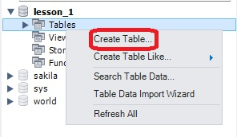
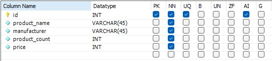
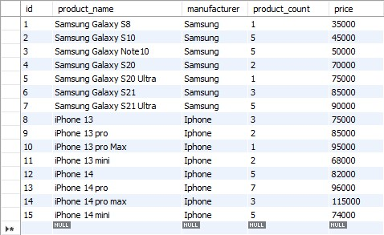

# Task №1

1) Создайте таблицу с мобильными телефонами, используя графический интерфейс. <br>
   Необходимые поля таблицы: product_name (название товара), manufacturer (производитель), <br> 
   product_count (количество), price (цена). Заполните БД произвольными данными.
2) Напишите SELECT-запрос, который выводит название товара, производителя и цену для товаров, <br>
   количество которых превышает 2.
3) Выведите SELECT-запросом весь ассортимент товаров марки “Samsung”.
4) *С помощью SELECT-запроса с оператором LIKE / REGEXP найти:
   * 1) Товары, в которых есть упоминание "Iphone"
   * 2) Товары, в которых есть упоминание "Samsung"
   * 3) Товары, в названии которых есть ЦИФРЫ
   * 4) Товары, в названии которых есть ЦИФРА "8"

# Solution:

1) * Создаём таблицу в Workbench: <br>
   
   
   * Заполняем поля таблицы: <br>
   
   
   * Заполняем произвольными данными: <br>
   

2) Пишем SELECT-запрос, который выводит название товара, производителя и цену для товаров, <br>
   количество которых превышает 2:
   
   ```MySQL
   SELECT product_name, manufacturer, price FROM lesson1_table WHERE product_count > 2;
   ```

3) Выведем SELECT-запросом весь ассортимент товаров марки “Samsung”:

   ```MySQL
   SELECT product_name, price, product_count FROM lesson1_table WHERE manufacturer LIKE '%Samsung%';
   ```

4) *С помощью SELECT-запроса с оператором LIKE / REGEXP найдём:
   * 1) Товары, в которых есть упоминание "Iphone"
   
   ```MySQL
   SELECT product_name, price, product_count FROM lesson1_table WHERE product_name OR manufacturer LIKE '%iPhone%';
   ```

   ```MySQL
   SELECT product_name, price, product_count FROM lesson1_table WHERE product_name OR manufacturer REGEXP 'Iphone';
   ```

   * 2) Товары, в которых есть упоминание "Samsung"

   ```MySQL
   SELECT product_name, price, product_count FROM lesson1_table WHERE product_name OR manufacturer LIKE '%Samsung%';
   ```

   ```MySQL
   SELECT product_name, price, product_count FROM lesson1_table WHERE product_name OR manufacturer REGEXP 'Samsung';
   ```

   * 3) Товары, в названии которых есть ЦИФРЫ

   ```MySQL
   SELECT product_name, price, product_count FROM lesson1_table WHERE product_name REGEXP '[^0-9]';
   ```

   * 4) Товары, в названии которых есть ЦИФРА "8"

   ```MySQL
   SELECT product_name, price, product_count FROM lesson1_table WHERE product_name LIKE '%8%';
   ```