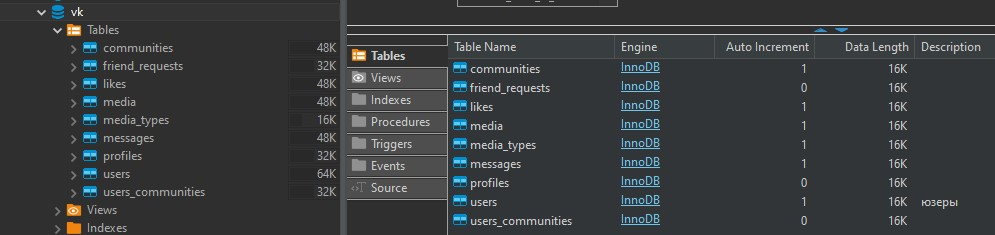

# Task №2

1) Создать БД vk, исполнив скрипт _vk_db_creation.sql (в материалах к уроку)
2) Написать скрипт, добавляющий в созданную БД vk 2-3   
   новые таблицы (с перечнем полей, указанием индексов и внешних ключей) (CREATE TABLE)
3) Заполнить 2 таблицы БД vk данными (до 10 записей в каждой таблице) (INSERT)
4) *Написать скрипт, отмечающий несовершеннолетних пользователей как неактивных (поле is_active = true).  
   При необходимости предварительно добавить такое поле в таблицу profiles  
   со значением по умолчанию = false (или 0)(ALTER TABLE + UPDATE)
5) *Написать скрипт, удаляющий сообщения «из будущего» (дата позже сегодняшней) (DELETE)

# Solution:

1) Создаём БД vk, исполнив скрипт [_vk_db_creation.sql](_vk_db_creation.sql)

2) Пишем скрипт, добавляющий новые таблицы (с перечнем полей, указанием индексов и внешних ключей) (CREATE TABLE)
   * Скрипт --> [ТЫК](_songs_script.sql)

3) Заполним таблицы БД vk данными (до 10 записей в каждой таблице) (INSERT):
   * Скрипт --> [ТЫК](_fill_data_script.sql)

4) Скрипт --> [ТЫК](_task_4_script.sql)
5) Скрипт --> [ТЫК](_task_5_script_.sql)
