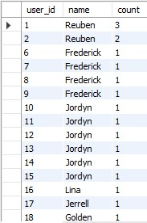
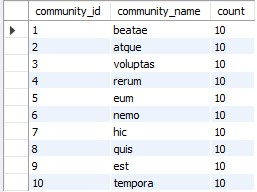
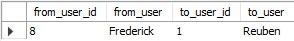
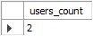
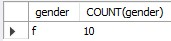

# Task №4

1) Подсчитать количество групп, в которые вступил каждый пользователь.
2) Подсчитать количество пользователей в каждом сообществе.
3) Пусть задан некоторый пользователь. Из всех пользователей соц. сети найдите человека,  
   который больше всех общался с выбранным пользователем (написал ему сообщений).
4) *Подсчитать общее количество лайков, которые получили пользователи младше 18 лет.
5) *Определить кто больше поставил лайков (всего): мужчины или женщины.

> Задания выполняются на БД vk и с данными, которые сгенерировали на прошлом уроке из скрипта 
> [_vk_db_seed.sql](_vk_db_seed.sql)

# Solution:

1) Скрипт --> [ТЫК](_task_1_script_.sql)  

2) Скрипт --> [ТЫК](_task_2_script_.sql)  

3) Скрипт --> [ТЫК](_task_3_script_.sql)  

4) Скрипт --> [ТЫК](_task_4_script_.sql)  

5) Скрипт --> [ТЫК](_task_5_script_.sql)  
